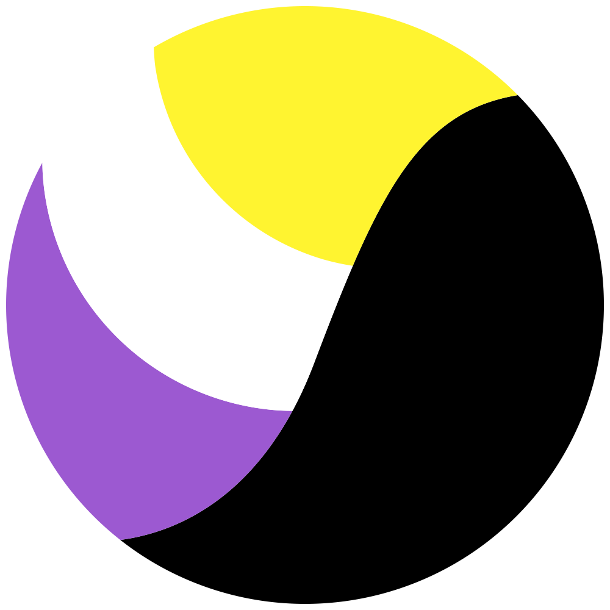

  

<h1 align="center">PronounBird for Twitter</h1>

   
    
    
    

#

## What is PronounBird?

PronounBird is a browser extension for Twitter that automatically parses user bios for their pronouns and displays them anywhere they are mentioned saving you the trouble of visiting their profile or hovering over them just to find them.

#

## Screenshots

   
  
  
  

#

## My pronouns are missing

To avoid *only one joke*, all (neo)pronouns are hardcoded. They are located inside `src/config.js`. Feel free to add your own by opening a PR, commenting on the [first issue](https://github.com/GeopJr/PronounBird/issues/3) or messaging me on any social media (you can find them on my profile readme or on [my website](https://geopjr.dev/contact)).

#

## Contributing

1. Read the [Code of Conduct](https://github.com/GeopJr/.github/blob/main/CODE_OF_CONDUCT.md)
2. Fork it ( https://github.com/GeopJr/PronounBird/fork )
3. Create your feature branch (git checkout -b my-new-feature)
4. Commit your changes (git commit -am 'Add some feature')
5. Push to the branch (git push origin my-new-feature)
6. Create a new Pull Request

#

## Credits

This is a fork of [doucheblock](https://github.com/MobileFirstLLC/doucheblock), give it a try!

Built with [Extension CLI](https://github.com/MobileFirstLLC/extension-cli/).
